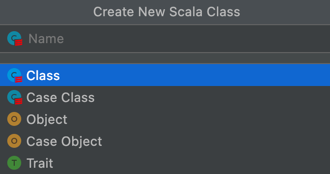

# p1 basic 

## 写在前面

全文将作为快速入门Scala的笔记，主要从Java的角度转Scala学习，会记录一些和Java的异同对比。

Scala是一门纯粹的面向对象的语言。在Scala语言中，每个值都是对象，每个操作都是方法调用

而Scala没有提供静态方法，改为使用单例对象方法。每一个独立应用程序都必须有一个定义在单例对象中的main方法。

虽然 Scala 没有要求文件名和单例对象名称一致，但是，这里仍然推荐像在Java里那样按照所包含的类名来命名文件，这样程序员可以通过查看文件名的方式方便地找到类。

而Java中除了字符串类型用首字母大写的String，其他八种基本类型都采用首字母小写的修饰符。

Scala还提供了一个Unit类型，类似Java中的void类型，表示“什么都不是”，主要作为不返回任何结果的函数的返回类型。

即将需要控制的语句块作为参数放在breakable后面，然后，其内部在某个条件满足时调用break方法，程序将跳出breakable方法

不同于Java的方括号，Scala使用圆括号来访问数组元素，索引也是从零开始。



新建一个类，就有这几个选项。这几个有什么区别？？？？

## 1.1 定义常量/变量

scala：val age:Int = 33

Java： const int age = 33;

**Scala 可以不写类型, 不写；**

val name = "tim"

val age1 = 33


## 1.2 流程控制
val ifexample = if(age > 18) age else 17

## 1.3 函数def 定义

def 方法名(参数列表)：返回结果类型={方法体}

def + 函数名字（in: type, out: type） = {逻辑}


main 方法, Unit = void
```scala
def main(args: Array[String]): Unit = {}
```


如果方法体只有一条语句，还可以省略方法体两边的大括号

```scala
def myFunction1(x:Int, y:String):String = {
  y + " " + x
}

def myFunction2(x:Int, y:String):String = y + " " + x

```

迭代器（Iterator）是一种提供了按顺序访问容器元素的数据结构。尽管构造一个迭代器与构造一个容器很类似，但迭代器并不是一个容器类，因为不能随机访问迭代器的元素，而只能按从前往后的顺序依次访问其元素。因此，迭代器常用于需要对容器进行一次遍历的场景。迭代器提供了两个基本操作：next和hasNext，可以很方便地实现对容器进行遍历。

```scala

object HelloWorld {
  def main(args: Array[String]): Unit = {
    println("hello xpengkang")
    println("every + - * / is the method in scala: ", 5.+(2222))

    val myStrArr = Array("love", "like", "thumb up")

    println(myStrArr.toString)

    val tuple = ("bigdate", 3, 56565, 3.00)
    // tuple can directly print in line
    println(tuple)
    var value = List("bigdata", "hadoop")
    
    // Iterator
    val iterator1 = Iterator("hadoop", "spark", "flink")
    while(iterator1.hasNext){
      println(iterator1.next())
    }
  }
}
```


## 1.4 Unit 类型

无意义的类型 = Java 里面的void
无返回值，如下
```scala
println("this is unit")
def myUnitFunction1():Unit = {
  println("hello, Unit is equal to void")
}
```


# p2 类和对象

## 2.1 object

object 单例对象, 有static字段/方法

```scala
  object MySingleton {
    def value = 232323
    def myMethod():Int = 121213
    def apply(x :Int):Int = x + 1
  }
  
  MySingleton.apply(1)
  MySingleton.value
  MySingleton.myMethod()
```

Scala程序的入口点main方法就是定义在一个孤立对象里。单例对象和类之间的另一个差别是，单例对象的定义不能带有参数列表，实际上这是非常显然的，因为不能用 new 关键字实例化一个单例对象，因此没机会传递参数给单例对象。

在Scala中，一切都是对象，包括函数也是对象。因此，Scala中的函数既保留了数学界中的括号调用样式，也可以使用面向对象的点号调用形式，其对应的方法名即为apply
```scala
object MyObj extends App {
  //和 Java 一样，可以定义类和变量，成员方法
  //object = public static void main(String[] args)
  class Order_tab {
    private val cnt = 10
    def count() = println(cnt + 1)
  }

  // 和Java 一样，可以new
  val order_tab = new Order_tab

  class Order_001(name: String) extends Order_tab

  val tab00 = new Order_001("tab001")
  private val unit: Unit = tab00.count(); // 继承
  println(unit)

  // 抽象类，和Java一样。abstract关键字，无方法的实现
  abstract class User{
    def buy():Unit
  }
  
}
```


## 2.2 trait

scala 不同Java ，有trait 关键字，表示特质，用with 连接

单继承，多特质
```scala
  trait Buyer{
    def fav():Unit
  }

  class Customs extends Order_tab with Buyer {
    override def fav(): Unit = ???
  }
```


## 2.3 case class

case class 是一种轻量级的数据结构，
类似Java的pojo类，但是不需要有参构造和重写toString方法。
初始化可以不用new 关键字

```scala
  case class Person(name:String,age: Int )

// 订单表
  case class OrderDetail(
                             id:Long,
                             user_id:Long,
                             order_time:Long,
                             timestamp:Long,
                             command:String
                           )

  val result = OrderDetail(11L,111L,1111L,10000L,"delete")
```


## 2.4 exceptions

对比Java和Scala 异常语法
```java
  try {
    sout()
  }catch (Exception e){
    sout()
  }
  
```

```scala
  try{
    println(111)
  }catch {
    case e: Exception => "xxxxx"
  }
```


## 2.5 generics 

和Java类似 在[里面类型，generic], 如
List[Int]

```scala
  val myList: List[Int] = List(1, 2, 3, 4, 5)
  private val head: Int = myList.head
  private val tail: List[Int] = myList.tail

  println(head) // 1
  println(tail) // List(2, 3, 4, 5)
```


# p3 functional programming

睡前发问：scala 是为etl 设计的吗？？？ 自带 map , flatmap, filter 函数

## 3.1 apply

函数 编程 = 所有的函数 是 函数类型的 实例 instance

先看代码
```scala
package com.xpengkang.p3

/**
  * @Author: kang.peng
  * @Date: 2022/8/19 8:24 AM
  * @Version 1.0
  */
object FunctionalProgram extends App{

  class Person(name : String) {
    def apply(age: Int) = println(s"age is $age")
  }
  val bob = new Person("tim")
//  age is 89
//  age is 88
  bob.apply(89)
  bob(88)
  
  // 函数 编程 = 所有的函数 是 函数类型的 实例 instance
  // 语法糖
  val doubler: Function1[Int, Int] = (x:Int) => 2*x
  doubler(4) // 8
  println(doubler(8))  // 16
  
}

```


## 3.2 map & flatmap & filter

map(x => x + 1) 

=> 表示输入和输出， 类似Java里面的lambda表达式 （in）-> (out)

```scala
// highre-order functions, map
  val mapList = List(1, 2,3).map(x => x + 1) // List(2, 3, 4)
  println(mapList) // List(2, 3, 4)

  // flatmap
  val flatList: List[Int] = List(1, 2, 3).flatMap(x => List(x, 2 * x))
  println(flatList)


  private val value: List[Int] = List(1, 2, 3, 4, 5).filter(x => x == 3)
  println(value)  //List(3)

```

上面等价于
```scala
  private val flatList: List[Int] = List(1, 2, 3).flatMap {
    x => List(x, 2 * x)
  }
```

## 3.3 _ 的用法
(x => x == 3) 等价于  (_ == 3)
```scala
  private val value: List[Int] = List(1, 2, 3, 4, 5).filter(x => x == 3)
  println(value)  //List(3)

  private val value1: List[Int] = List(21, 22, 23, 24).filter(_ == 3)
  println(value1)
```

备注：


println(s"age is $age")
字符串前面的s 是 自动生成的，代表这里有参数替换，
不同与Java，Java 用 + 拼接的方法或者 %d


技巧： 每次在变量后面加点var +  enter 回车能自动返回类型

map(x => x + 1).var     


# p4 Pattern Matching

这个概念好像在Java没有

关键字 match  case =>  

这个方法会执行完所有的case ，如果没有匹配到任何结果，会抛出MatchError

```scala
object PatternMatch {
  
  val storeID = 1234
  val storeName = storeID match {
    case 1 => "kfc"
    case 2 => "dell"
    case 3 => "apple"
    case _ => "third class grand"
  }
  println(storeName)
  
}
```
上面方法没有main 是无法执行的，执行的是extencs App 可以直接执行。
改为：

```scala
object PatternMatch extends App{
  
  val storeID = 1234
  val storeName = storeID match {
    case 1 => "kfc"
    case 2 => "dell"
    case 3 => "apple"
    case _ => "third class grand"
  }
  println(storeName)
}
```

match case => 的用法很灵活，可以分解提取case class, tuples，列表的字段

```scala
  case class OrderDetail(
                        OrderId: Long,
                        daytime: Long
                        )
  val personGreeting = OrderDetail match {
    case OrderDetail(n, a) => s" order ID is $n ， and today is  $a ."
    case _ => "Something else"
  }

  // deconstructing tuples
  val aTuple = ("java", "scala")
  val bandDescription = aTuple match {
    case (java, flink) => s"$java and $flink"
    case (java, scala) => "true"
    case _ => "others ======"
  }

  // decomposing lists
  val aList = List(1,2,3)
  val listDescription = aList match {
    case List(_, 2, _) => "List containing 2 on its second position"
    case _ => "unknown list"
  }
```


# The official repository for the Rock the JVM Scala at Light Speed course

This repository contains the code we wrote during  [Rock the JVM's Scala at Light Speed](https://rockthejvm.com/course/scala-at-light-speed) mini-course/video series. Unless explicitly mentioned, the code in this repository is exactly what was caught on camera.

## How to install

- if you don't have IntelliJ IDEA installed, install it from the [official site](https://jetbrains.com)
- either clone the repo or download as zip
- open with IntelliJ as an SBT project

### How to start

Clone this repository and checkout the `start` tag by running the following in the repo folder:

```
git checkout start
```

### How to see the final code

The master branch contains the final code, so you can download the repository as is, or if you've navigated somewhere in the code history, then do

```
git checkout master
```

### How to run an intermediate state

The repository was built while recording the videos. Prior to each video, I tagged each commit so you can easily go back to an earlier state of the repo!

The tags are as follows:

* `start`
* `basics`
* `object-orientation`
* `functional-programming`
* `pattern-matching`
* `advanced`

When you watch a video, you can `git checkout` the appropriate tag and the repo will go back to the exact code I had when I started the lecture.

### For questions or suggestions

If you have changes to suggest to this repo, either
- submit a GitHub issue
- tell me in the comments to the videos
- submit a pull request!
